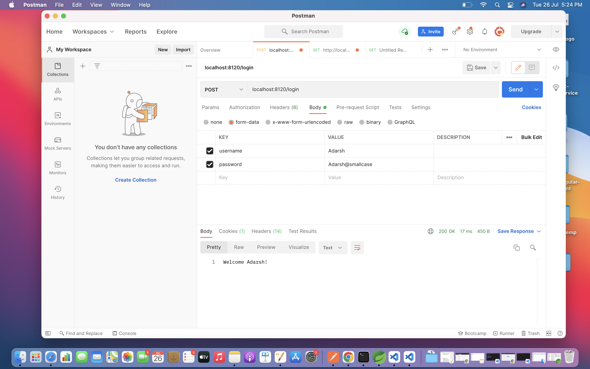
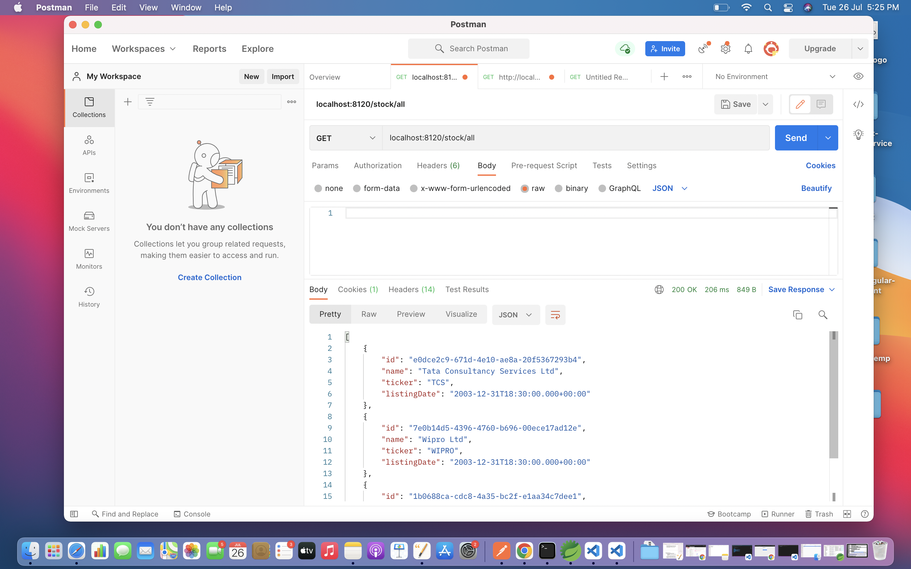
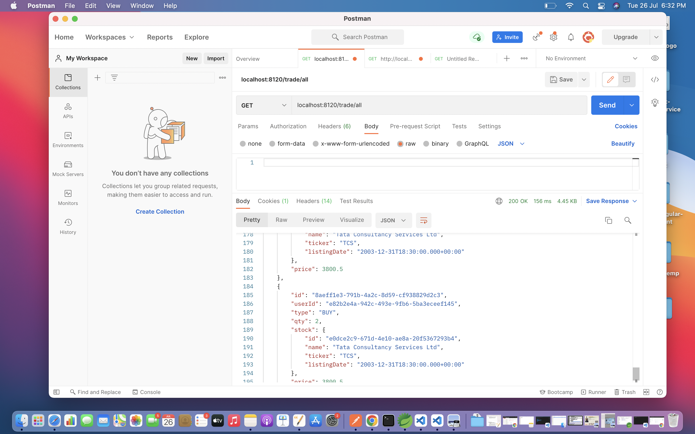
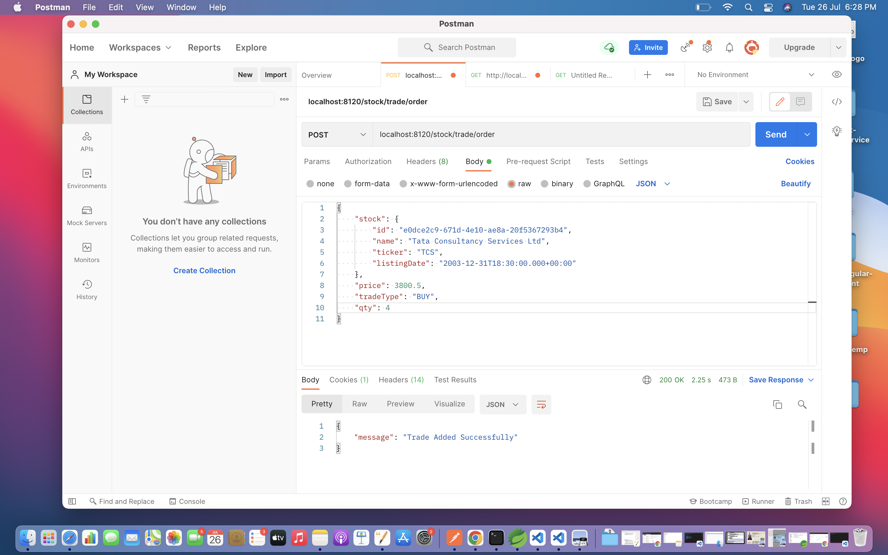
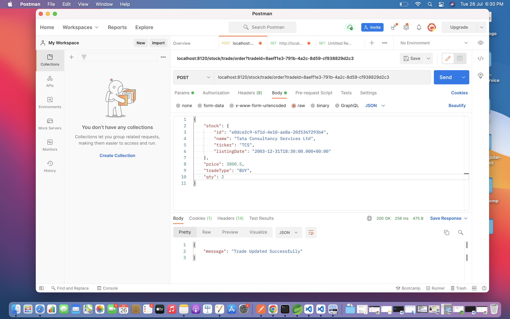
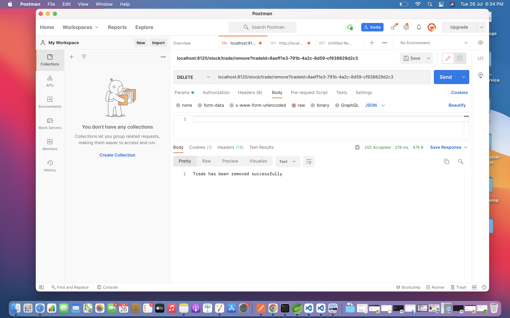
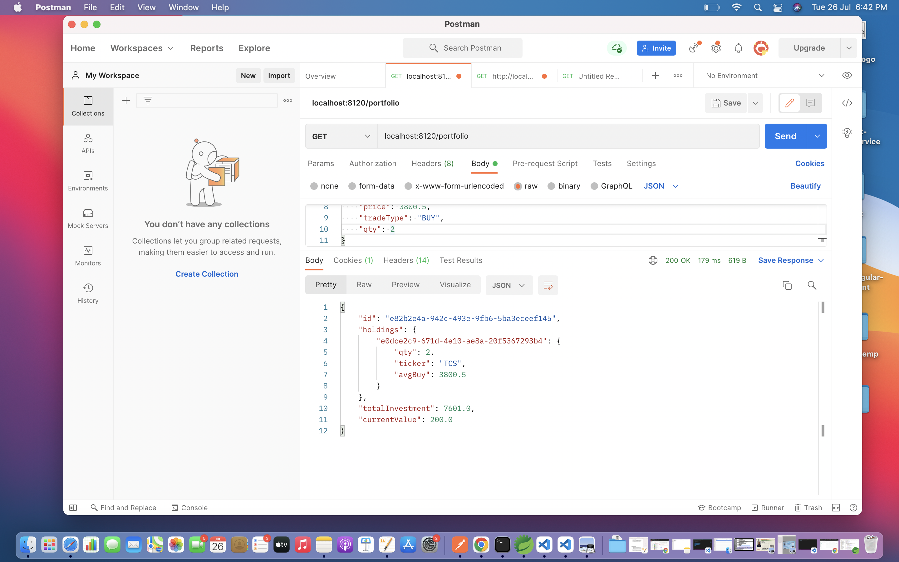

# Portfolio-tracking-API
Simple Portfolio tracking project

**API ROUTES**  
Root URL: https://assignment-portfolio-tracking.herokuapp.com  
1. Login  
path: /login | POST Request Body (Form-Data)  
username:Adarsh  
password:Adarsh@smallcase
-------------------

2. Stock  
path: /stock/all | GET Request   
Description: This endpoint will fetch the list of stock models from the database. Right now I've saved 3 stocks as directed in the assignment document. You may leaverage this end point to make the Request body for add or update stock trade.  I could've used only the stock ids in the request body but I've this flow in mind that a user while placing a add trade order UI must be having a stock model in place. 
-------------------
  
path: /stock?stockId=  
Gets the stock with that specific id    

3. Trade Details  
path: /trade/all , GET request  
  
path: /trade?tradeId= (to get specific trade)   
Description: This endpoint can be utilized to show the list of trades to the user.   

4. Add a trade [assumed an obvious flow in UI that going to that particular stock first then placing the order]  
path: /stock/trade/order | POST request   
Description: All necessary validations I've placed. Only validated input request will go inside the service logic. Proper exception with the corresponding message with HTTP status bad request will be returned in case of Negative scenarios. Please leaverage /stock/all endpoint to get the desired stock model and along with that you need to add qty,tradeType and price fields in request body.  

5. Edit a trade  
path: /stock/trade/order?tradeId= | POST Request  
Description: Probably the most puzzling part of application. Here I've covered all the scenarios and required validations. Here, complete removal of OldTrade will happen when: 1.Stocks (ids) are different 2. If stocks are same then tradeType is different. Oldtrade needed to be removed while simultaneously checking if it can be removed or not and then only new trade order can be placed. (if it could) ELSE difference in quantities are calculated and BUY or Sell cases are handled sepereately. 
  

6. Remove a Trade  
path: /stock/trade/remove , DELETE request  
  
7. UserPortfolio  
path: /portfolio | GET request  
  

